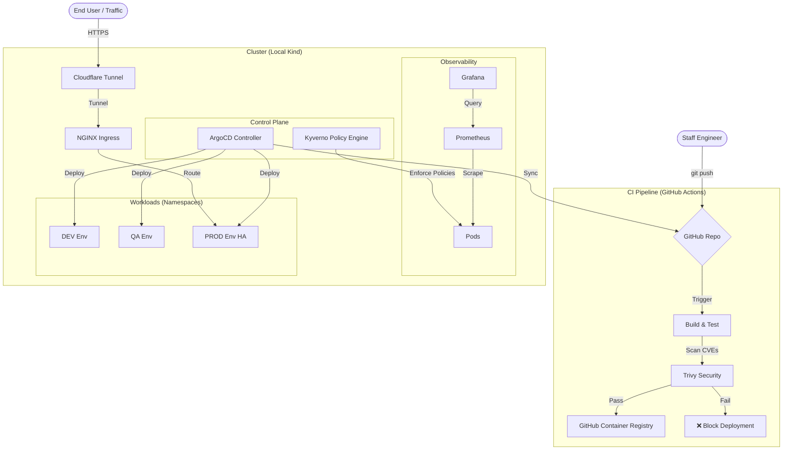

# 🚀 Staff SRE / DevSecOps Portfolio

> **A Hybrid-Cloud, GitOps-driven Microservices Platform running on Local Infrastructure.**
> *Designed to demonstrate architectural patterns for Resilience, Security, and Observability without Cloud Provider costs.*

---

## 🏗️ High-Level Architecture

This platform simulates a real-world Enterprise environment using **Kind (Kubernetes in Docker)** and **Cloudflare Tunnels** to expose services securely. It implements a strictly declarative **GitOps** workflow.

---

Built by Amarjyoti Lahkar
